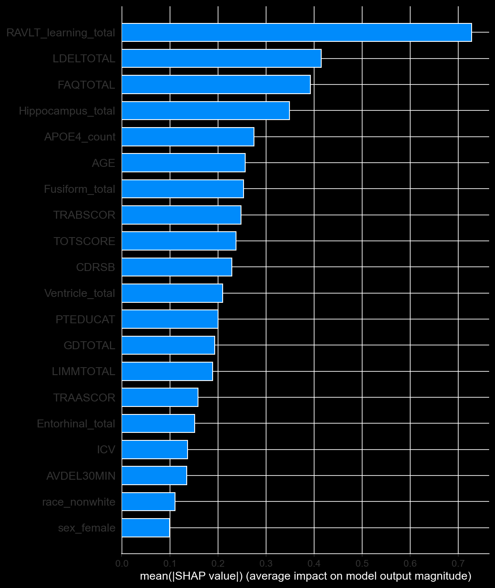
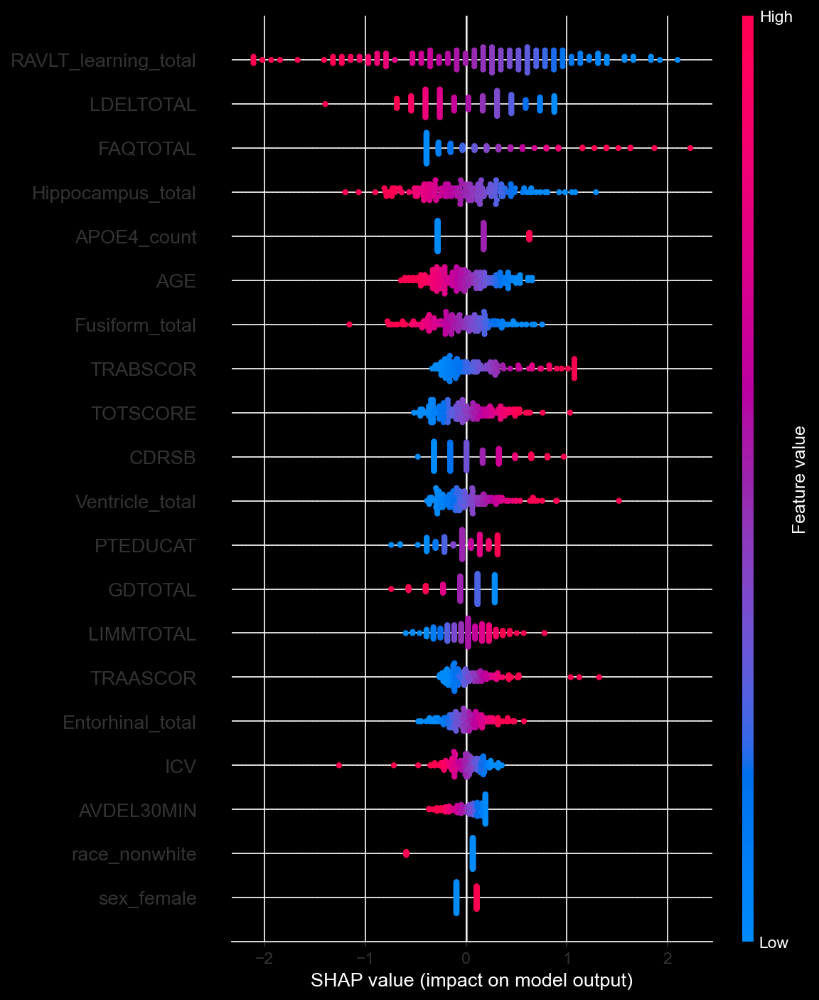

# MCI to Dementia Conversion Predictor

**A dual-model machine learning system that predicts whether a patient with Mild Cognitive Impairment (MCI) will convert to dementia within 24 months — using only baseline clinical data available at the point of diagnosis.**

[](https://python.org)
[](https://scikit-learn.org)
[](LICENSE)

---

## The Core Finding

> **Accessible cognitive tests and demographics predict MCI-to-dementia conversion nearly as well as expensive CSF biomarkers and brain imaging — making reliable prediction viable in resource-limited clinical settings.**

Adding amyloid-β, tau, and phospho-tau CSF biomarkers to the model did not improve predictive performance. The model without these invasive, expensive tests achieved AUC 0.887 versus 0.891 with them — a difference smaller than the model's fold-to-fold variability, confirming statistical equivalence. This is not a limitation: it is the finding.

---

## Clinical Motivation

Mild Cognitive Impairment affects 15–20% of adults over 65. Roughly one-third convert to Alzheimer's disease within two years — but predicting *which* patients will convert at the time of MCI diagnosis remains a critical unsolved clinical problem. Reliable prognostic tools could enable:

- Earlier intervention and trial enrollment for high-risk patients
- Targeted follow-up scheduling based on conversion risk
- Equitable risk stratification across diverse populations

Most published prediction models require CSF biomarkers (collected by lumbar puncture) or quantitative MRI, creating resource barriers that exclude most clinical settings globally. This project demonstrates that a model built from routinely administered cognitive tests is both high-performing and generalizable.

---

## Results

### Model Comparison (ADNI Training Cohort)

| Model | Feature Set | AUC (5-fold CV) | 95% Bootstrap CI | Converter Recall |
|---|---|---|---|---|
| Logistic Regression — **Primary** | 26 features (cognitive + neuropsych + MRI) | **0.887** | [0.832, 0.939] | 0.75 |
| Random Forest | 26 features (same set) | 0.891 | [0.836, 0.955] | 0.50 |
| XGBoost | 26 features (same set) | 0.870 | — | 0.65 |
| Logistic Regression + CSF | 29 features (+ amyloid-β, tau, p-tau) | 0.893\* | [0.836, 0.955] | — |
| **Accessible LR — no MRI/RAVLT** | **16 features (cognitive + demographics)** | **0.871** | — | — |

\* *CI fully overlaps with primary model; difference not statistically significant.*

**Logistic regression was selected as the primary model**: it matched more complex algorithms, has narrower cross-validation variance (±0.004 vs ±0.018 for RF), and produces coefficients interpretable in clinical terms.

### External Validation (NACC — Independent Cohort)

The 16-feature accessible model was validated on an entirely independent dataset never seen during training:

| Cohort | N | AUC | 95% CI | Converter Recall |
|---|---|---|---|---|
| NACC — complete cases | 1,974 | **0.805** | [0.784, 0.826] | 0.783\* |
| NACC — full imputed | 6,321 | 0.781 | [0.768, 0.793] | — |

\* *After threshold recalibration from 0.5 → 0.261 using Youden's J on a calibration split.*

**The NACC cohort is 8× larger than the ADNI training set and substantially more demographically diverse** — providing a rigorous generalization test. An AUC of 0.805 on a fully held-out, more diverse population confirms that the model captured real, generalizable signal rather than ADNI-specific patterns.

### Fairness Analysis (NACC Complete-Case Cohort)

| Subgroup | N | AUC | 95% CI |
|---|---|---|---|
| White | — | 0.798 | [0.775, 0.822] |
| Non-white | — | 0.832 | [0.781, 0.880] |
| Male | — | 0.810 | — |
| Female | — | 0.801 | — |
| Younger (< 73) | — | 0.842 | [0.811, 0.873] |
| Older (≥ 73) | — | 0.771 | [0.740, 0.799] |

No significant racial or sex disparity was found despite training on a 93%-white ADNI cohort. A modest but real age-related performance gap was identified (younger vs. older patients) and is discussed in [Limitations](#limitations).

---

## The Dual-Model System

A central design decision addresses the reality of resource heterogeneity in clinical settings:

```
Patient has RAVLT, ADAS, and MRI available?
    YES → 26-feature model  (AUC 0.887, requires full neuropsychological workup)
    NO  → 16-feature model  (AUC 0.871, requires only routine cognitive tests)
```

The routing rule is automatic: if the patient's data includes ≥50% of the "premium" features (RAVLT, ADAS, MRI volumes), the system uses the full model; otherwise it falls back to the accessible model. The performance difference is 0.016 AUC — within the model's own noise range — making the accessible model a clinically viable alternative in settings where advanced testing is unavailable.

This is packaged as a single deployable bundle (`mci_conversion_predictor.joblib`) containing both models, feature lists, routing logic, and performance metadata.

---

## Feature Importance (SHAP Analysis)

SHAP analysis on the primary 26-feature model identified the strongest predictors, consistent with established Alzheimer's neurobiology:

| Feature | SHAP Score | Interpretation |
|---|---|---|
| RAVLT_learning_total | 0.728 | Verbal learning — the dominant predictor |
| LDELTOTAL (Logical Memory Delayed) | ~0.38 | Delayed verbal recall |
| FAQTOTAL | ~0.35 | Functional impairment in daily activities |
| Hippocampus_total | ~0.30 | Hippocampal atrophy |
| APOE4_count | ~0.25 | Genetic risk — each ε4 allele increases risk |




The model learned clinically meaningful patterns — not statistical artifacts. Notably, when RAVLT is excluded from the accessible model, Logical Memory (which measures the same delayed verbal recall domain) absorbs nearly all of its predictive role, confirming that **what matters is capturing the cognitive domain, not any specific test instrument**.

---

## Methods Overview

### Cohort Construction (ADNI)
- Source: Alzheimer's Disease Neuroimaging Initiative (ADNI) — multi-site longitudinal cohort
- Starting population: 3,788 unique patients across 15,881 visits
- Target cohort: patients diagnosed with MCI at their first (baseline) visit
- Conversion label: MCI → Dementia within 24 months (30-month grace window), requiring ≥18 months of follow-up to classify stable patients
- Final labeled cohort: **816 patients** (239 converters, 577 stable; 29% conversion rate)

### Feature Engineering
- **Cognitive**: ADAS-11/13, MMSE, CDR Sum of Boxes, Geriatric Depression Scale
- **Neuropsychological battery**: RAVLT (learning, 30-min delay, total delay), Trails A & B, animal fluency, Logical Memory (immediate + delayed)
- **Functional**: FAQ Total (10-item functional activities questionnaire)
- **Brain Imaging**: FreeSurfer-derived volumes (hippocampus, entorhinal cortex, lateral ventricles, fusiform gyrus) + intracranial volume from FSX7 (latest reprocessing)
- **Genetics**: APOE ε4 allele count (0, 1, or 2) derived from genotype
- **Demographics**: age (computed from DOB), years of education, sex, race (binary: White/Non-white), ethnicity (Hispanic/Non-Hispanic), marital status
- Features with >40% missing data excluded; MoCA excluded despite clinical relevance (50% missing in ADNI1, not missing at random)

### Modeling
- Class imbalance (29/71%) addressed via `class_weight='balanced'`
- Pipeline: median imputation → StandardScaler → LogisticRegression
- Evaluation: 5-fold stratified cross-validation; 2,000-iteration bootstrap CIs
- Primary metric: AUC-ROC (threshold-free); secondary: converter recall (sensitivity)

### External Validation (NACC)
- Independent cohort: National Alzheimer's Coordinating Center (NACC)
- 56,532 unique patients; 6,321 MCI-at-baseline; 35.9% conversion rate
- Feature harmonization: 16 features available in both datasets
- ADNI-trained model applied to NACC without retraining (pure generalization test)
- Threshold recalibrated on a held-out NACC calibration split; reported on a separate NACC test split

See [docs/methodology.md](docs/methodology.md) for full technical details.

---

## Repository Structure

```
Alzheimer-MCI-prediction/
├── README.md
├── requirements.txt
├── LICENSE
├── .gitignore
│
├── models/                    # Trained model files (.joblib)
│   ├── README.md              # How to obtain and place models
│   └── mci_conversion_predictor.joblib   # Complete dual-model bundle
│
├── notebooks/
│   ├── 01_ADNI_model_training.ipynb       # Full training pipeline
│   └── 02_NACC_external_validation.ipynb  # External validation + fairness
│
├── src/
│   └── predict.py             # Importable prediction library
│
├── app/
│   └── app.py                 # Streamlit interactive app
│
├── docs/
│   └── methodology.md         # Detailed methods write-up
│
└── images/
    ├── shap_importance_bar.png
    └── shap_beeswarm.png
```

---

## Running the App

### Prerequisites
```bash
pip install -r requirements.txt
```

Ensure the model bundle is in `models/mci_conversion_predictor.joblib`. See [models/README.md](models/README.md).

### Launch
```bash
streamlit run app/app.py
```

The app opens in your browser. Enter a patient's baseline measurements, and it will:
1. Auto-select the appropriate model (26-feature or 16-feature) based on available inputs
2. Output the 24-month dementia conversion probability with a risk interpretation
3. Display a SHAP feature-contribution chart explaining which inputs drove the prediction

### Using the Prediction Library Directly
```python
from src.predict import load_predictor, predict_patient

predictor = load_predictor("models/mci_conversion_predictor.joblib")

patient = {
    'MMSCORE': 26,       # MMSE (0–30, higher = better)
    'CDRSB': 2.5,        # CDR Sum of Boxes
    'FAQTOTAL': 8,       # FAQ Total (0–30)
    'LIMMTOTAL': 8,      # Logical Memory Immediate
    'LDELTOTAL': 4,      # Logical Memory Delayed
    'CATANIMSC': 14,     # Animal fluency
    'TRAASCOR': 45,      # Trails A (seconds)
    'TRABSCOR': 140,     # Trails B (seconds)
    'GDTOTAL': 3,        # GDS Depression Scale
    'AGE': 74,
    'PTEDUCAT': 16,
    'APOE4_count': 1,    # 0, 1, or 2 ε4 alleles
    'sex_female': 1,
    'race_nonwhite': 0,
    'ethnicity_hispanic': 0,
    'married': 1,
}

result = predict_patient(patient, predictor)
print(f"Conversion probability: {result['probability']*100:.1f}%")
print(f"Risk band: {result['risk_band']}")
print(f"Model used: {result['model_used']}")
```

---

## Limitations

This is a research tool, not a clinical diagnostic system. Honest limitations:

1. **Single-cohort training.** The primary model was trained exclusively on ADNI, a US-based research cohort that is 93% white, highly educated, and predominantly recruited from academic medical centers. While external NACC validation demonstrated generalizability, performance in truly diverse global populations is unknown.

2. **Age-related performance gap.** The model predicts conversion less accurately in patients ≥73 (AUC 0.771 vs. 0.842 for younger patients). In older cohorts, cognitive decline has more competing etiologies (vascular changes, other dementias, normal aging), making MCI-to-Alzheimer's conversion inherently harder to predict cleanly. Adding NACC training data did not close this gap, suggesting it reflects the underlying biology rather than representation bias.

3. **MRI features require neuroimaging infrastructure.** The 26-feature primary model includes FreeSurfer-derived brain volumes. Where MRI is unavailable, the 16-feature accessible model achieves nearly equivalent performance (AUC 0.871 vs. 0.887).

4. **No prospective validation.** Both ADNI and NACC are retrospective cohorts. The model has not been tested in a prospective deployment setting.

5. **Threshold calibration is population-specific.** The recalibrated NACC threshold (0.261) improves recall for diverse populations but was optimized for NACC demographics. Clinical deployment would require site-specific calibration.

---

## Data Availability

**The ADNI and NACC datasets are not included in this repository.** Access to both requires registration and data use agreements through their respective portals:

- **ADNI (Alzheimer's Disease Neuroimaging Initiative)**: [adni.loni.usc.edu](https://adni.loni.usc.edu)  
  *Data collection and sharing was funded by the Alzheimer's Disease Neuroimaging Initiative (ADNI) (National Institutes of Health Grant U01 AG024904).*
- **NACC (National Alzheimer's Coordinating Center)**: [naccdata.org](https://naccdata.org)

All trained model weights (`.joblib` files) are included and can be used without access to the original data.

---

## Limitations & Ethics

This tool is intended for **research and educational purposes only**. It has not been clinically validated for patient-level decision-making. Predictions should not be used to guide clinical care without the oversight of a qualified healthcare professional.

---

## Author

**Victor Chimaobim Onuh**  
Junior Specialist, Baraban Lab — Department of Neurosurgery, UCSF  
Associate Editor & Peer Reviewer, *Journal of Alzheimer's Disease*

- GitHub: [Vichizzy](https://github.com/Vichizzy)
- LinkedIn: [victor-c-onuh](https://www.linkedin.com/in/victor-c-onuh-81647b208)
- Email: victor@uni.minerva.edu

**Related Publication:**  
Onuh, V.C. (2025). *Advancing Alzheimer's Disease Treatment: A literature review on senolytic intervention.* Journal of Alzheimer's Disease.  
[DOI: 10.1177/13872877251376540](https://doi.org/10.1177/13872877251376540) | [PMID: 40982213](https://pubmed.ncbi.nlm.nih.gov/40982213/)

---

## License

This project is licensed under the MIT License. See [LICENSE](LICENSE) for details.

The trained model weights are released under the same license for research use. They were derived from ADNI and NACC data, which have their own data use agreements governing downstream use.
